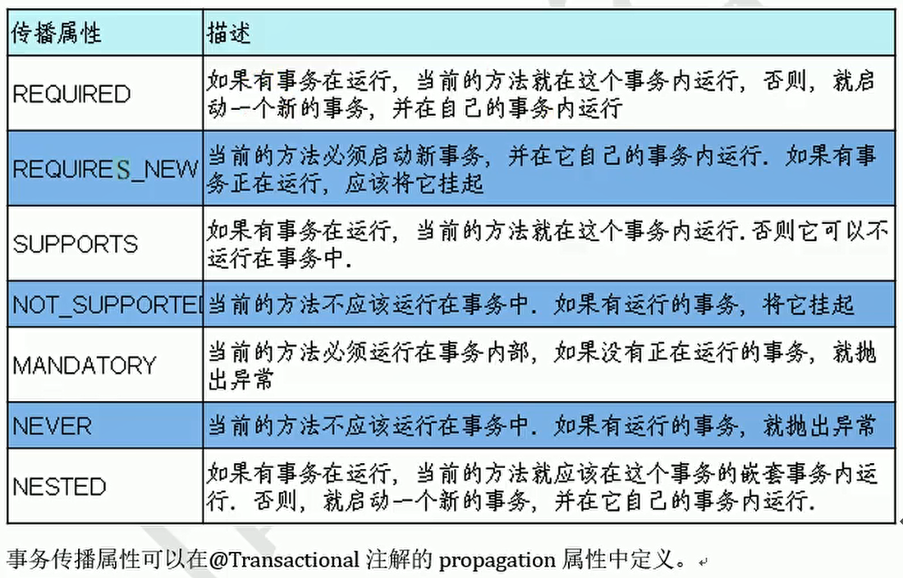
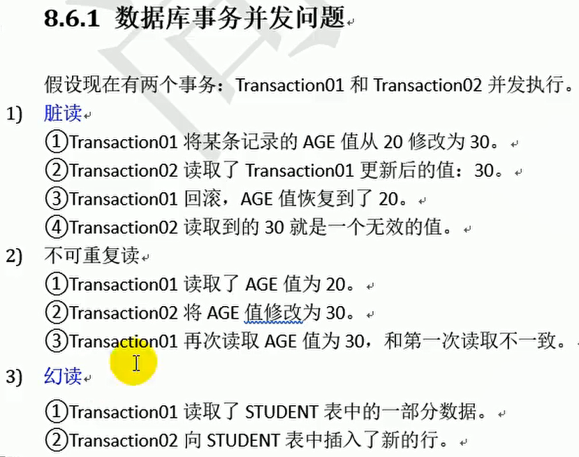
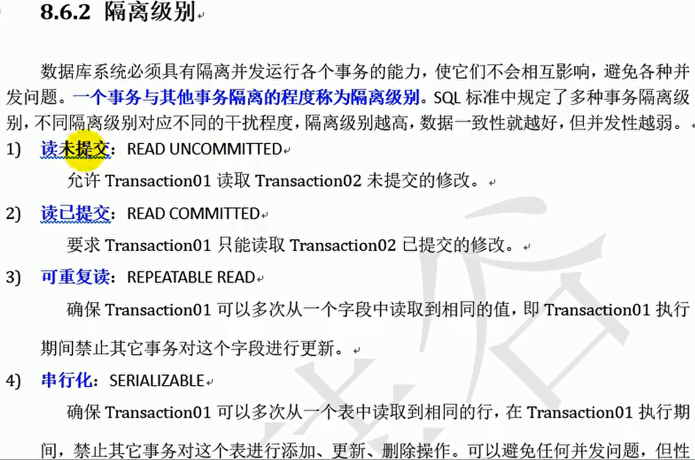
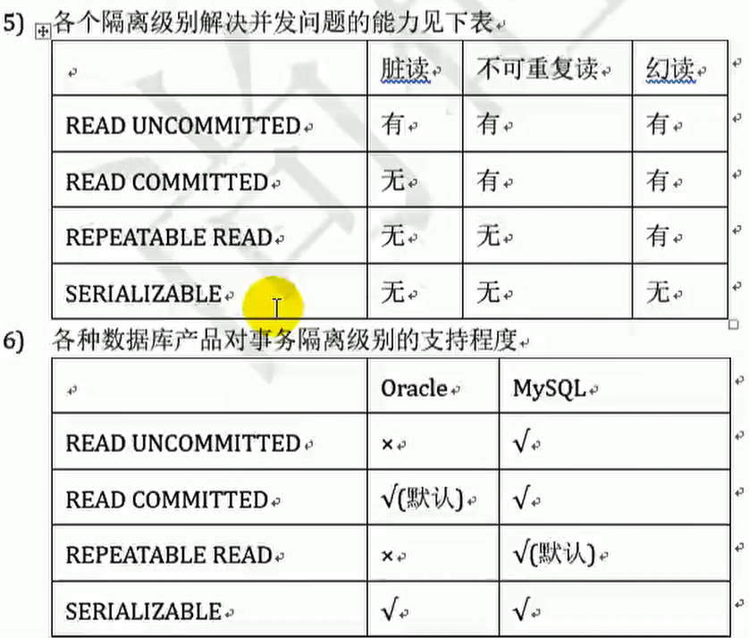
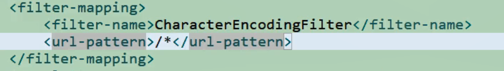
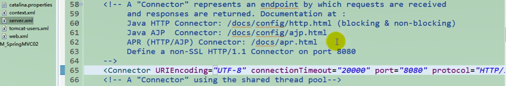
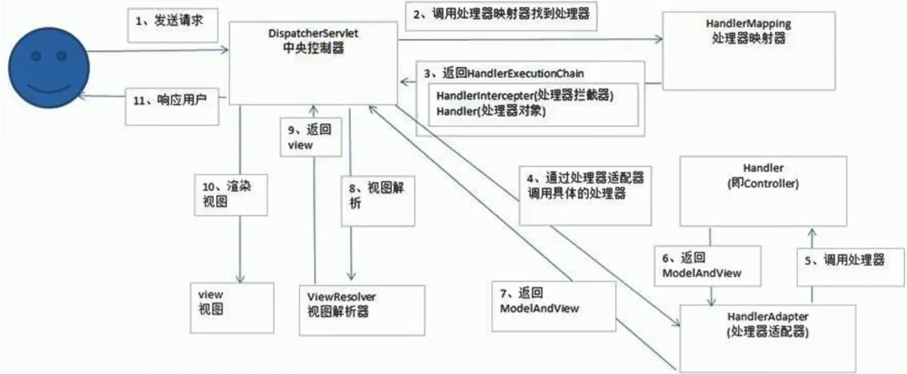

##### 1.Spring Bean 的作用域之间有什么区别？

可以通过scope属性来指定bean的作用域

- singleton：默认值。当IOC容器一创建就会创建bean的实例，而且是单例的，每次得到的都是同一个
- prototype：原型的。当IOC容器一创建不再实例化该bean，每次调用getBean方法时再实例化该bean，而且每调用一次创建一个对象
- request：每次请求实例化一个bean
- session：在一次会话中共享一个bean

##### 2.请简单介绍Spring支持的常用数据库事务传播属性和事务隔离级别？

事务的属性：

1. propagation：用来设置事务的传播行为

   事务的传播行为：一个方法运行在了一个开启了事务的方法中时，当前方法是使用原来的事务还是开启一个新的事务

   - Propagation.REQUIRED：默认值，使用原来的事务

   - Propagation.REQUIRES_NEW：将原来的事务挂起，开启一个新的事务

     

2. isolation：用来设置事务的隔离级别

   - Isolation.REPEATABLE_READ：可重复读，MySQL默认的隔离级别

   - Isolation.READ_COMMITTED：读已提交，Oracle默认的隔离级别，开发时通常使用的隔离级别

     

     

     

     

     

     

##### 3.SpringMVC中如何解决POST请求中文乱码问题，GET的又如何处理呢？

- POST在过滤器中配置 CharacterEncodingFilter 类，以及指定 encoding|UTF-8、forceEncoding|true 参数，以及映射所有请求 /* 即可。

  

  

- GET在tomcat中 server.xml 找到第一个 Connector 标签，并加上 URIEncoding="UTF-8" 即可。

  

##### 4.简单的谈一下SpringMVC的工作流程

- 处理模型数据方式一：将方法的返回值设置为 ModelAndView

- 处理模型数据方式二：方法的返回值仍是String类型，在方法的入参中传入Map、Model或者ModelMap不管将处理器方法的返回值设置为ModelAndView还是在方法的入参中传入Map、Model或者ModelMap，StringMVC都会转换为一个ModelAndView对象

  

##### 5.MyBatis中当实体类中的属性名和表中的字段名不一样，怎么办？

