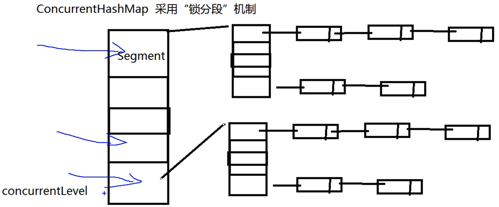

##### 一、volatile关键字，内存可见性问题

- 内存可见性问题是，当多个线程操作共享数据时，彼此不可见

- volatile 关键字：当多个线程进行操作共享数据时，可以保证内存中的数据可见。相较于 synchronized 是一种较为轻量级的同步策略

  注意：

  - volatile 不具备“互斥性”
  - volatile 不能保证变量的“原子性”

##### 二、原子性问题

- **读-改-写**三个步骤的时延，造成了线程中值重复的问题

- 原子变量，jdk1.5 后 java.util.concurrent.atomic 包下提供了常用的原子变量：

  - volatile 保证内存可见性

  - CAS（Compare-And-Swap）算法保证数据的原子性，CAS 算法是硬件对于并发操作共享数据的支持

    CAS 包含了三个操作数：

    - 内存值 V

    - 预估值 A

    - 更新值 B

      当且仅当 V == A 时， V = B。否则，将不做任何操作

##### 三、ConcurrentHashMap 锁分段机制

- Java5.0 在 java.util.concurrent 包中提供了多种并发容器类来改进同步容器的性能。
- ConcurrentHashMap 同步容器类是 Java5 增加的一个线程安全的哈希表。对于多线程的操作，介于 HashMap 与 Hashtable 之间。内部采用“锁分段”机制替代 Hashtable 的独占锁。进而提高性能。
- 此包还提供了设计用于多线程上下文中的 Collection 实现：ConcurrentHashMap、ConcurrentSkipListMap、ConcurrentSkipListSet、CopyOnWriteArrayList 和 CopyOnWriteArraySet。当期望许多线程访问一个给定 collection 时，ConcurrentHashMap 通常优于同步的 TreeMap。当期望的读数和遍历远远大于列表的更新数时，CopyOnWriteArrayList 优于同步的 ArrayList。

- Hashtable的复合操作，“若不存在则添加”、“若存在则删除”，这些操作效率非常的低！

- ConcurrentHashMap 采用“锁分段”机制

  

- CopyOnWriteArrayList/CopyOnWriteArraySet : "写入并复制"——注意：添加操作多时，效率低，因为每次添加时都会进行复制，开销非常的大。并发迭代操作多时可以选择。

##### 四、CountDownLatch 闭锁

- Java5.0 在 java.util.concurrent 包中提供了多种并发容器类来改进同步容器的性能。

- CountDownLatch 一个同步辅助类，在完成一组正在其他线程中执行的操作之前，它允许一个或多个线程一直等待。

- 闭锁可以延迟线程的进度直到其到达终止状态，闭锁可以用来确保某些活动直到其他活动都完成才继续执行：

  - 确保某个计算在其需要的所有资源都被初始化之后才继续执行；

  - 确保某个服务在其依赖的所有其他服务都已经启动之后才启动；

  - 等待直到某个操作所有参与者都准备就绪再继续执行。

    ```java
    public class TestCountDownLatch {
        public static void main(String[] args) {
            final CountDownLatch latch = new CountDownLatch(5);
            LatchDemo ld = new LatchDemo(latch);
            long start = System.currentTimeMillis();
            for (int i = 0; i < 5; i++) {
                new Thread(ld).start();
            }
            try {
                latch.await();
            } catch (InterruptedException e) {
            }
            long end = System.currentTimeMillis();
            System.out.println("耗费时间：" + (end - start));
        }
    }
    class LatchDemo implements Runnable {
        private CountDownLatch latch;
        public LatchDemo(CountDownLatch latch) {
            this.latch = latch;
        }
        @Override
        public void run() {
            synchronized (this) {
                try {
                    for (int i = 0; i < 50000; i++) {
                        if (i % 2 == 0) {
                            System.out.println(i);
                        }
                    }
                } finally {
                    latch.countDown();
                }
            }
        }
    }
    ```

##### 五、实现 Callable 接口

- 创建执行线程的方式三：实现 Callable 接口。相较于实现 Runnable 接口的方式，方法可以有返回值，并且可以抛出异常。

 * 执行 Callable 方式，需要 FutureTask 实现类的支持，用于接收运算结果。FutureTask 是 Future 接口的实现类

   ```java
   public class TestCallable {
       public static void main(String[] args) {
           ThreadDemo td = new ThreadDemo();
           // 1.执行 Callable 方式，需要 FutureTask 实现类的支持，用于接收运算结果。
           FutureTask<Integer> result = new FutureTask<>(td);
           new Thread(result).start();
           // 2.接收线程运算后的结果
           try {
               Integer sum = result.get(); // FutureTask 可用于 闭锁
               System.out.println(sum);
               System.out.println("-------------------------------");
           } catch (InterruptedException | ExecutionException e) {
               e.printStackTrace();
           }
       }
   }
   class ThreadDemo implements Callable<Integer> {
       @Override
       public Integer call() throws Exception {
           int sum = 0;
           for (int i = 0; i <= 100000000; i++) {
               sum += i;
           }
           return sum;
       }
   }
   ```

##### 六、Lock 同步锁

- 用于解决多线程安全问题的方式

   * synchronize：隐式锁

      - 同步代码块

      - 同步方法

   * jdk 1.5 后：

      - 同步锁 Lock——注意：是一个显示锁，需要通过 lock() 方法上锁，必须通过 unlock() 方法进行所释放

  ```java
  public class TestLock {
      public static void main(String[] args) {
          Ticket ticket = new Ticket();
          new Thread(ticket, "1号窗口").start();
          new Thread(ticket, "2号窗口").start();
          new Thread(ticket, "3号窗口").start();
      }
  }
  class Ticket implements Runnable {
      private int tick = 100;
      private Lock lock = new ReentrantLock();
      @Override
      public void run() {
          while (true) {
              lock.lock(); // 上锁
              try {
                  if (tick > 0) {
                      try {
                          Thread.sleep(200);
                      } catch (InterruptedException e) {
                      }
                      System.out.println(Thread.currentThread().getName() + " 完成售票，余票为：" + --tick);
                  }
              } finally {
                  lock.unlock(); // 释放锁
              }
          }
      }
  }
  ```

- 生产者和消费者案例，运用等待唤醒机制，为了避免虚假唤醒问题，object.wait() 方法应该总是使用在循环中，详见地址中相应方法：https://www.matools.com/file/manual/jdk_api_1.8_google/java/lang/Object.html

##### 七、Condition 控制线程通信

- Condition 接口描述了可能会与锁有关联的条件变量。这些变量在用法上与使用 Object.wait 访问的隐式监视器类似，但提供了更强大的功能。需要特别指出的是，单个 Lock 可能与多个 Condition 对象关联。为了避免兼容性问题，Condition 方法的名称与对应的 Object 版本中的不同。

- 在 Condition 对象中，与 wait、notify 和 notifyAll 方法对应的分别是 await、signal 和 signalAll。

- Condition 实例实质上被绑定到一个锁上。要为特定 Lock 实例获得 Condition 实例，请使用其 newCondition() 方法。

  ```java
  public class TestProducerAndConsumerForLock {
      public static void main(String[] args) {
          Clerk clerk = new Clerk();
          Producer pro = new Producer(clerk);
          Consumer cus = new Consumer(clerk);
          new Thread(pro, "生产者 A").start();
          new Thread(cus, "消费者 B").start();
          new Thread(pro, "生产者 C").start();
          new Thread(cus, "消费者 D").start();
      }
  }
  // 店员
  class Clerk {
      private int product = 0;
      private Lock lock = new ReentrantLock();
      private Condition condition = lock.newCondition();
      // 进货
      public void get() { // 循环次数：0
          lock.lock();
          try {
              while (product >= 1) { // 运用等待唤醒机制，为了避免虚假唤醒问题，应该总是使用在循环中
                  System.out.println("产品已满！");
                  try {
                      condition.await();
                  } catch (InterruptedException e) {
                  }
              }
              System.out.println(Thread.currentThread().getName() + " : " + ++product);
              condition.signalAll();
          } finally {
              lock.unlock();
          }
      }
      // 卖货
      public void sale() { // product = 0; 循环次数：0
          lock.lock();
          try {
              while (product <= 0) {
                  System.out.println("缺货！");
                  try {
                      condition.await();
                  } catch (InterruptedException e) {
                  }
              }
              System.out.println(Thread.currentThread().getName() + " : " + --product);
              condition.signalAll();
          } finally {
              lock.unlock();
          }
      }
  }
  ```


