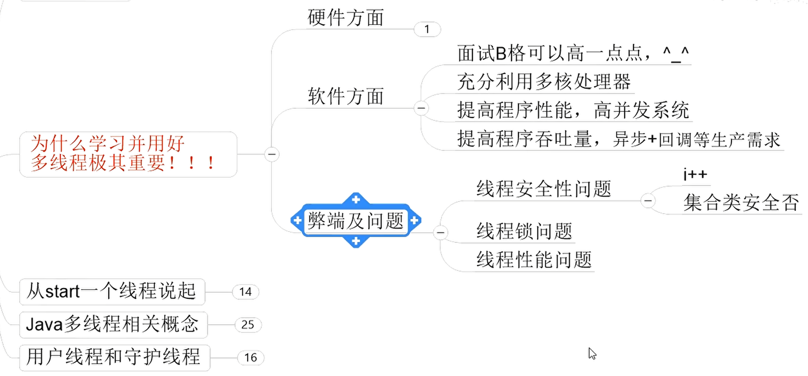
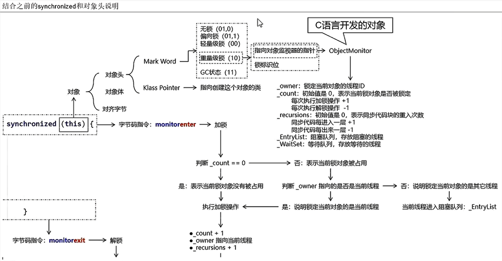

# JUC并发编程与源码分析

## 1、本课程前置知识及要求说明


## 2、线程基础知识复习




## 3、CompletableFuture

### 概述


### 并发函数参数


## 4、说说Java“锁”事

### 多线程死锁


### 如何排查死锁


### 小总结


## 5、LockSupport与线程中断


## 6、Java内存模型之JMM

可见性

原子性

有序性


## 7、volatile与JMM

volatile：可见性、有序性——排序要求，禁止重排


## 8、CAS


## 9、原子操作类之18罗汉增强


## 10、聊聊ThreadLocal


## 11、Java对象内存布局和对象头

### 对象构成布局

#### 对象实例

- 对象头
  - 对象标记Mark Word
  - 类元信息（又叫类型指针）
- 实例数据
- 对齐填充


#### 对象标记Mark Word


#### 类元信息（又叫类型指针）


#### 对象头实例说明


Hotspot术语表官网说明地址：[官网说明](https://openjdk.org/groups/hotspot/docs/HotSpotGlossary.html)


源码实现地址：[源码实现](https://github.com/openjdk/jdk8u/blob/master/hotspot/src/share/vm/oops/oop.hpp)


#### 64位虚拟机（非常重要）


#### 源码解析


#### Hotspot的实现（非常重要，64位标记图）


#### 证明以上结构

JOL（Java Object Layout）证明，官网地址：[JOL官网](https://openjdk.org/projects/code-tools/jol/)

工具源码地址：[工具源码](https://github.com/openjdk/jol)

```
# 打印代码方法
ClassLayout.parseInstance(new Object()).toPrintable();
```

结果呈现说明


GC年龄


JVM虚拟机打印参数：java -XX:+PrintCommandLineFlags -version

压缩（-XX:+UseCompressedClassPointers）、对齐到8字节的倍数


## 12、Synchronized与锁升级

锁的升级过程


### synchronized性能变化

Java5之前，用户态和内核态之间的切换


markOop.hpp


Monitor


synchronized和对象头说明




### synchronized锁种类及升级步骤

#### 64位标记图（非常重要）


锁指向


无锁


#### 偏向锁


64位标记图再看


偏向锁的持有说明


细化举例


偏向锁命令

```shell
java -XX:+PrintFlagsInitial | grep biasedLock*
```


参数系统默认开启


第一种情况


第二种情况


#### 撤销


下图中红线流程部分为偏向锁获取和撤销流程：


#### 轻量级锁

轻量级锁的获取


补充


关闭偏向锁，就可以直接进入轻量级锁：

```shell
-XX:-UseBiasedLocking
```

自旋次数

Java6之前


Java6之后


自适应自旋


轻量锁与偏向锁的区别和不同


#### 重量级锁

锁标志位


#### 小总结

锁升级发生后，hashcode去哪啦


各种锁的优缺点、synchronized锁升级和实现原理


#### JIT编译器对锁的优化


##### 锁消除

锁消除问题，JIT编译器会无视它，synchronized(o), 每次new出来的，不存在了，非正常。

从JIT角度看相当于无视它，synchronized(o)不存在了，这个锁对象并没有被共用扩散到其它线程使用，

极端的说就是根本没有加这个锁对象的底层机器码，消除了锁的使用

##### 锁粗化

假如方法中首尾相接，前后相邻的都是同一个锁对象，那JIT编译器就会把这几个synchronized块合并成一个大块，

加粗加大范围，一次申请锁使用即可，避免次次的申请和释放锁，提升了性能

##### 小总结


## 13、AbstractQueuedSynchronizer之AQS

### 前置知识


### AQS入门级别理论知识

#### 官网解释


#### 队列结构示意图


#### 和AQS有关的


#### 锁和同步器的关系

##### 锁，面向锁的使用着


##### 同步器，面向锁的实现者


#### 加锁会导致阻塞


解释说明


#### 源码说明


#### AQS同步队列的基本结构


### AQS源码分析前置知识储备

#### AQS内部体系架构


#### 变量state


#### CLH队列


#### 小总结


#### Node


#### 属性说明


### AQS源码深度讲解和分析

#### 总体结构


#### ReentrantLock的原理


#### 公平和非公平


#### 非公平锁开始讲解


#### lock()


#### 三大走向


#### 源码总体结构


## 14、ReentrantLock、ReentrantReadWriteLock、StampedLock讲解

### 课程总纲


### 读写锁的意义


### 读写锁的演化过程


#### 锁降级说明


#### 锁降级过程


#### 锁降级2


### 不可锁升级


### 写锁和读锁是互斥的


### StampedLock粗讲


#### Oracle源码总结


### 邮戳锁


#### 锁饥饿问题


#### 解决？


#### 邮戳锁登场


#### 一句话


#### 邮戳锁特点


#### 邮戳锁的三种访问模式


#### StampedLock


#### StampedLock的缺点


### 全部演化过程


## 15、课程总结与回顾

### 多下苦功夫


高级精英只能是这样辛苦的不断前进，打磨研究！！！


### 终章回顾


### “琐”事儿


### synchronized及升级优化


#### 锁的到底是什么


#### 64位图

Hotspot的实现


### CAS


#### CAS的底层原理


#### ABA问题


### volatile


### LockSupport和线程中断


#### LockSupport.park和Object.wait区别


### AbstractQueuedSynchronizer


#### 是什么


#### 出队入队Node


### ThreadLocal


### 原子增强类Atomic


### 青山不改绿水长流，一定练习，大大加油！！！


