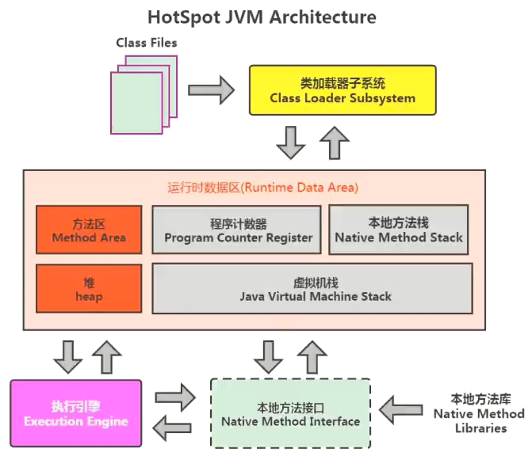
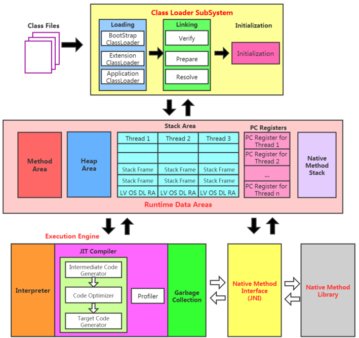
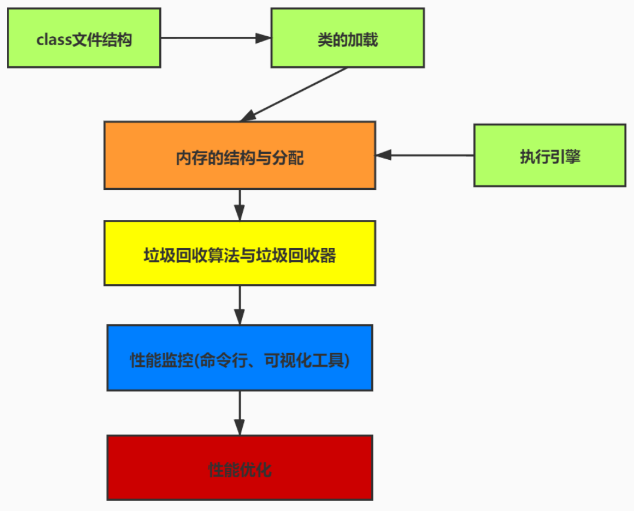

### 说说你认识的JVM？

hotSpot VM

JRockit

J9

### JVM的生命周期？

**虚拟机的启动**
Java虚拟机的启动是通过引导类加载器(bootstrap class loader)创建一个初始类(initial class)来完成的，这个类是由虚拟机的具体实现指定的。

**虚拟机的退出有如下的几种情况:**

- 某线程调用Runtime类或System类的exit方法，或 Runtime类的halt方法，并且Java安全管理器也允许这次exit或halt操作。
- 程序正常执行结束
- 程序在执行过程中遇到了异常或错误而异常终止
- 由于操作系统出现错误而导致Java虚拟机进程终止

### 重点说下HotSpot？

- SUN的JDK版本从1.3.1开始运用HotSpot虚拟机， 2006年底开源，主要使用C++实现，JNI接口部分用C实现。
- HotSpot是较新的Java虚拟机，使用JIT(Just in Time)编译器，可以大大提高Java运行的性能。
- Java原先是把源代码编译为字节码在虚拟机执行，这样执行速度较慢。而HotSpot将常用的部分代码编译为本地(原生，native)代码，这样显着提高了性能。
- HotSpot JVM 参数可以分为规则参数(standard options)和非规则参数(non-standard options).规则参数相对稳定，在JDK未来的版本里不会有太大的改动。 非规则参数则有因升级JDK而改动的可能。

### 能画出jvm架构图吗？

这个架构可以分成三层看：

- 最上层：javac编译器将编译好的字节码class文件，通过java 类装载器执行机制，把对象或class文件存放在 jvm划分内存区域。
- 中间层：称为Runtime Data Area，主要是在Java代码运行时用于存放数据的，从左至右为方法区(永久代、元数据区)、堆(共享,GC回收对象区域)、栈、程序计数器、寄存器、本地方法栈(私有)。
- 最下层：解释器、JIT(just in time)编译器和 GC（Garbage Collection，垃圾回收器）

### JVM有哪几块知识脉络？

