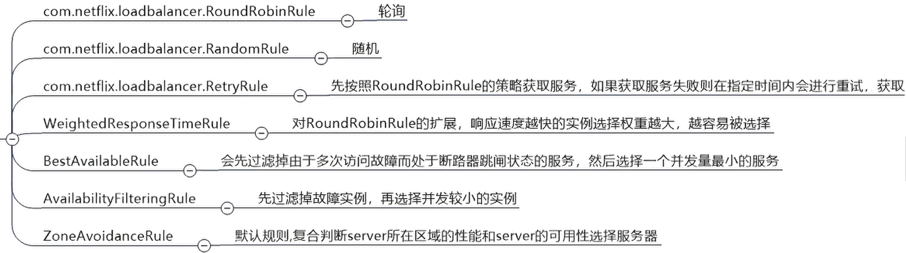
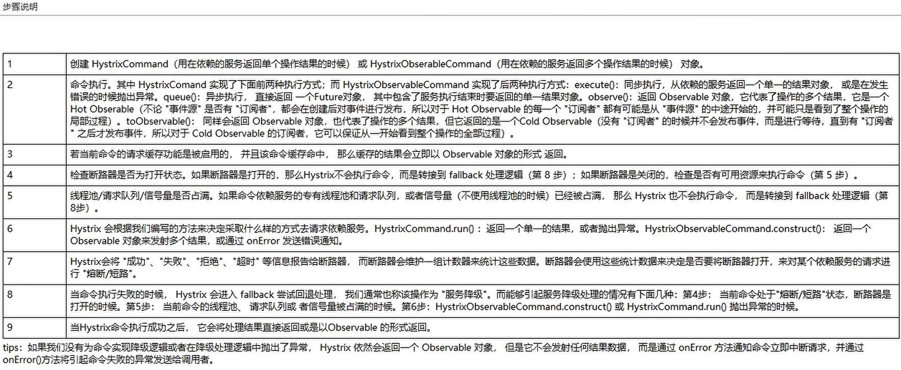
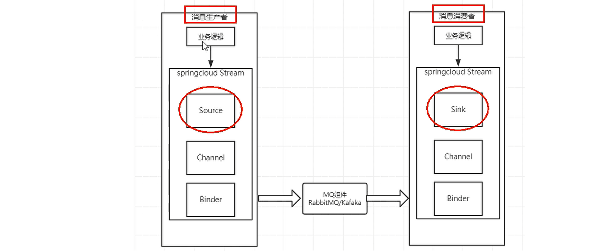
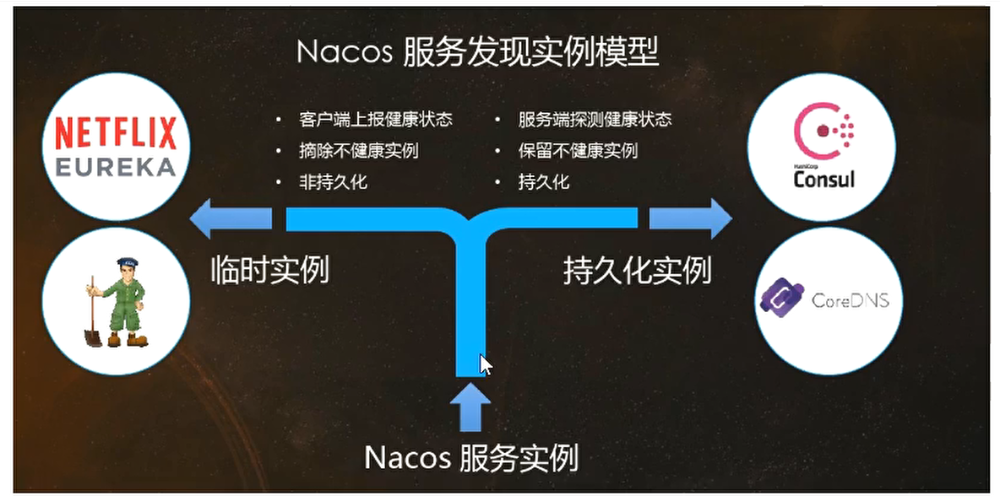
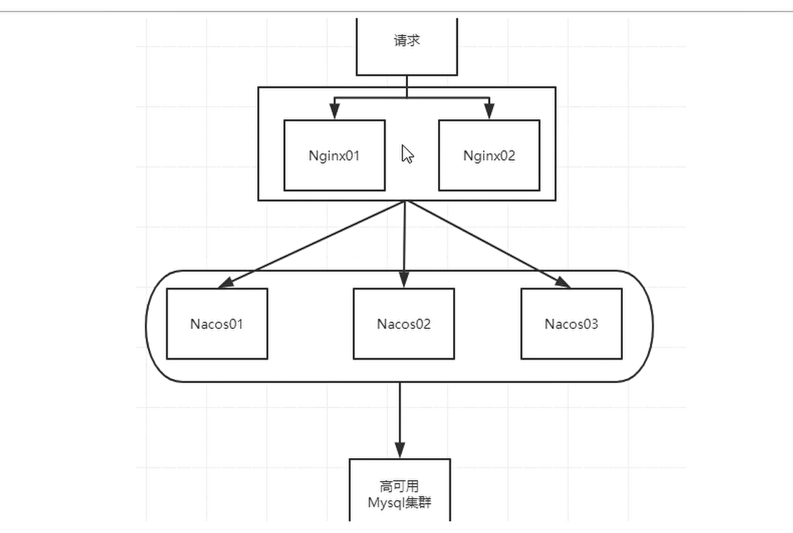
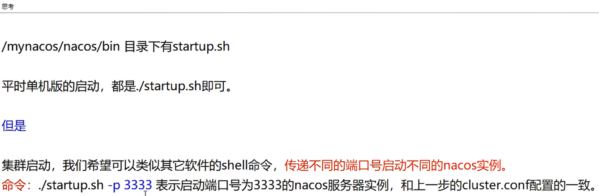
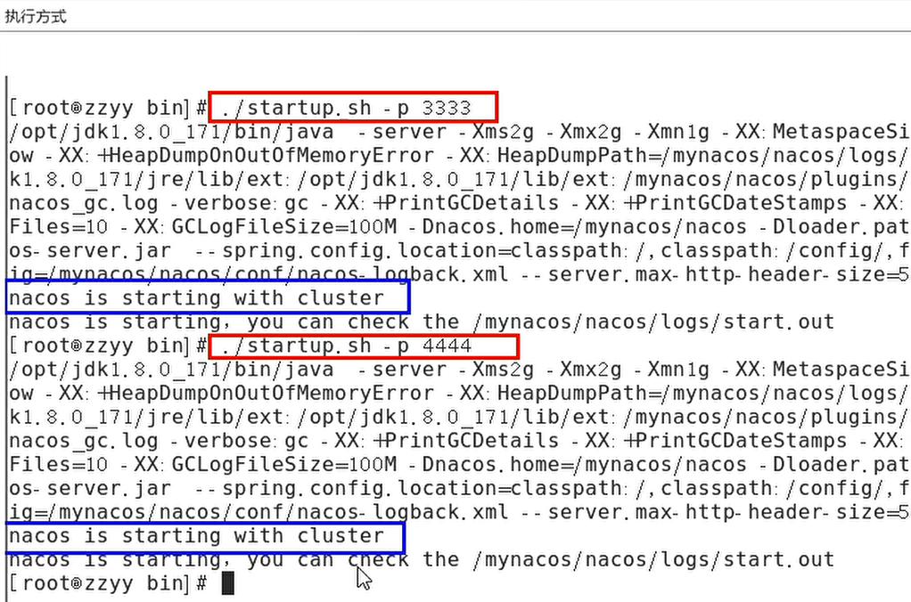
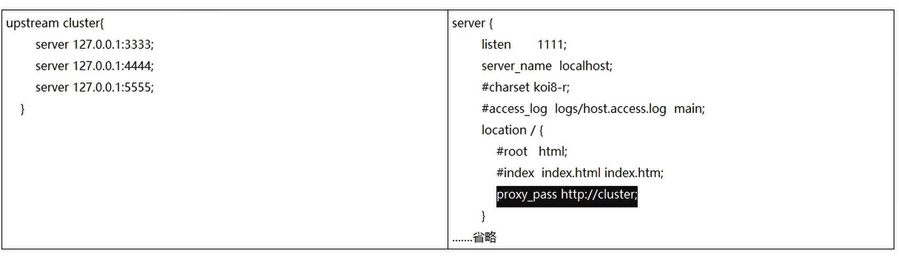
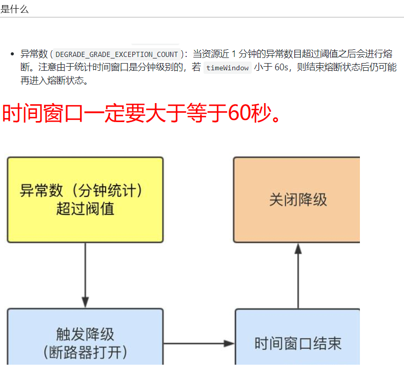

## Cloud升级

### 课程文档文件

[文档](./file/SpringCloud2020.mmap)

### Cloud升级

官网链接：[SpringCloud](https://github.com/spring-cloud)

### Ribbon负载均衡服务调用

#### Ribbon的轮询方式：

#### 负载均衡算法原理：

### OpenFeign服务接口调用

#### 概览

#### 能干什么

Feign和OpenFeign两者区别

#### 官网文档

[Feign源码](https://github.com/OpenFeign/feign)

[OpenFeign源码](https://github.com/spring-cloud/spring-cloud-openfeign)

[OpenFeign文档](https://docs.spring.io/spring-cloud-openfeign/docs/4.0.2/reference/html/)

### Hystrix断路器

#### 服务雪崩

#### 是什么

#### 文档官网

[官网](https://github.com/Netflix/Hystrix/wiki/How-To-Use)

#### 服务降级

#### 服务熔断

#### 服务限流

#### 详解降级

##### 服务问题与解决

##### 官方文档

[文档demo](https://github.com/Netflix/Hystrix)

##### 降级解决膨胀和混乱问题

#### 详解熔断

##### 熔断是什么

[大神论文](https://martinfowler.com/bliki/CircuitBreaker.html)

##### 代码

##### 重点测试

##### 小总结

熔断类型

断路流程图

##### 断路器什么情况下起作用

##### 开启和关闭的条件

##### 断路器打开之后

##### All配置

[all配置源码地址](https://github.com/Netflix/Hystrix/blob/master/hystrix-core/src/main/java/com/netflix/hystrix/HystrixCommandProperties.java)

#### 熔断流程图

##### 步骤说明

#### dashboard配置

### zuul路由网关

#### 暂无笔记

### Gateway新一代网关

#### 概述

#### 架构

#### zuul和spring cloud Gateway 的区别

#### zuul模型

#### Gateway模型

### SpringCloud Config 分布式配置中心

### SpringCloud Bus 消息总线

#### 是什么

#### 能干嘛

#### 总线

#### 架构图

##### 选择二原因如下

#### 总结

### SpringCloud Stream 消息驱动

#### 一句话

#### 为什么用Cloud Stream

#### 凭什么解决差异

##### Binder

#### 标准套路

##### 常用API

##### YML

[使用官方文档](https://docs.spring.io/spring-cloud-stream/docs/current/reference/html/spring-cloud-stream-binder-rabbit.html#rabbit-dlq-processing)

#### 消费

##### 生产实际案例

#### 分组

#### 持久化

没接收到会捡起来继续消费

### SpringCloud Sleuth 分布式请求链路跟踪

#### 问题

#### 解决

#### zipkin

##### 名词解释

### SpringCloud Alibaba 入门简介

[部分停止维护](https://spring.io/blog/2018/12/12/spring-cloud-greenwich-rc1-available-now)

#### 维护模式

#### 是什么

#### 能干嘛

#### 怎么玩

[官方文档](https://github.com/alibaba/spring-cloud-alibaba/blob/2022.x/README-zh.md)

### SpringCloud Alibaba Nacos服务注册和配置中心

#### 是什么

#### 注册中心比较

#### 详细说明

##### 全景图

##### Nacos和CAP

##### Nacos支持AP和CP模式的切换

##### bootstrap和application

##### 自动更新配置

##### 官方集成文档

[官方文档](https://nacos.io/zh-cn/docs/quick-start-spring-cloud.html)

##### 小总结

##### 多环境

###### 设计

##### 持久化

[集群持久化官网文档](https://nacos.io/zh-cn/docs/cluster-mode-quick-start.html)

###### 架构图

###### 说明

[多模式官网说明](https://nacos.io/zh-cn/docs/deployment.html)

##### 修改脚本

###### 思考

###### 修改内容

###### 执行方式

###### nginx

#### 高可用小总结

### SpringCloud Alibaba Sentinel实现熔断与限流

#### Hystrix和Sentinel比较

#### 特征

#### 使用

[官方文档](https://spring-cloud-alibaba-group.github.io/github-pages/2021/en-us/index.html#_spring_cloud_alibaba_sentinel)

#### 限流

##### 说明

##### 限流

##### 关联

##### 预热

[官方文档说明](https://github.com/alibaba/Sentinel/wiki/%E6%B5%81%E9%87%8F%E6%8E%A7%E5%88%B6)

##### 配置

##### 应用场景

#### 降级

##### 基本介绍

##### 说明

##### 半开

##### RT

###### 是什么

###### 结论

##### 异常比例

###### 是什么

###### 结论

##### 异常数

###### 是什么

##### 热点参数限流

###### 复习

##### 参数例外项

###### 异常

##### 系统自适应限流

##### SentinelResource

###### 需要兜底的问题

##### 更多

###### 核心API

##### 集成Ribbon

###### 代码结构

###### 结论

###### 图说

##### 集成Feign

##### 熔断框架比较

##### 持久化

###### 关键配置

### SpringCloud Alibaba Seata处理分布式事务

#### 分布式问题

#### 解决方案

[官方文档](https://seata.io/zh-cn/index.html)

##### 分布式过程

###### 一

###### 三

#### 处理过程

##### 怎么玩

#### 业务说明

##### 建库效果

##### 代码

#### 补充

##### 再看三大组件

##### 分布式事务执行流程

##### 如何对业务无侵入

###### 是什么

###### 一阶段加载

###### 二阶段提交

###### 二阶段回滚

###### 补充

### 面试杂谈

